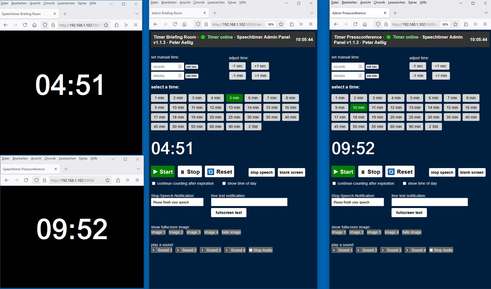

# speechtimer  1.1.3
I would like to share my latest project: a web based speech timer that makes managing talks a breeze.  
Admin and speechtimer run on any device that has a modern browser. (PC/Mac/Lnx/IOS/Android/Kindle etc.)  

I also have two ready to use Raspi4 images. The smaller one fits on a 4GB card and has no desktop. Operation via PuTTY and WinSCP.  
The larger one fits on a 8GB card) starts with LDXE Desktop, so network/wifi can also be easily set up using a monitor/mouse/keyboard.  
This image starts in kiosk mode and also shows the first speechtimer.html output (55055) on the HDMI output of the Raspi.  

**Introducing SpeechTimer **
Speechtimer is a simple and easy-to-use programme for controlling a presenter's speaking time.  
The basic programme is a python script **app.py** and two HTML files, **admin.html** and **speechtimer.html**  
All these modules must run in the same network. No internet is required.  
Admin and speechtimer run on any device that has a modern browser. (PC/Mac/Lnx/IOS/Android/Kindle etc.)  
You can also start app.py several times by turning app.py into app.py2 and assigning a new port number.  
You can enter the room name in the app instances (app.py / app2.py / app3.py / app4.py etc.), this will then be displayed in the TAB tabs of the browser and in the Admin Console.  
**Raspi4 Image** 4 instances are installed on the Raspi-Image and start automatically when booting  

You install Python and the necessary extensions on your computer (PC/Mac/**Raspi***), copy the files into the speechtimer directory.   
then you start python app.py and can then access speechtimer and admin in the same network.  
The details are described in the manuals or visible in the code.  
The Raspi Images will autostart 4 Instances of the Timer (port55055 -55058), the Desktop Image starts also Timer1 (55055) in Kiosk Mode and outputs it on the Raspi4 HDMI Out.  

**For the Raspi4 you can download a smaller (fits on a 4GB card) ready to use NON DESKTOP image:**  
**For the Raspi4 you can download a larger (fits on a 8GB card) ready to use DESKTOP image:**  (Quit Kiosk Mode DIsplay with ALT-F4)  
*[Raspi4 Image links](https://drive.google.com/drive/folders/1aS9zuvYhaSjZAqpjX2A-KHDxk3yzTw-w?usp=sharing)  

**Tech Stack**  
Flask + Flask SocketIO backend in Python  
– Serves both the public timer page and the secured admin panel  
– Handles real time events (start, stop, reset, adjust time, and custom messages) via WebSockets 
– can run multiple times, just adapt the roomname und the port adress in app.py and copy it to app2.py/app3.py

**HTML/CSS/JS Frontend**  
start your server with python app.py  
Start your output and controls with 192.168.1.210:55055 this shows the speechtimer and 192.168.1.210:55055/admin shows the control (IP and Port Numbers are examples only)  
start your second timer with python app2.py  
Start your SECOND output and controls with 192.168.1.210:55056 this shows the speechtimer and 192.168.1.210:55056/admin shows the control (IP and Port Numbers are examples only)  

– Admin Panel (admin.html): select preset times, set custom seconds/minutes, start/stop/reset, adjust on the fly, toggle overtime, show/hide clock, send fullscreen text or images, and play/stop sound cues
– Timer Display (speechtimer.html): full screen countdown with red warning when time’s up, custom “stop speech” messages, blank screen mode, image or text overlays, and optional clock in the corner  

**Key Features**  
-Preset & Custom Timing: one click buttons for common durations plus manual entry  
-Dynamic Control: pause, resume, reset, and even add/subtract seconds or minutes mid timer  
-Notifications: show a custom “Please finish your speech” alert or any free text message in fullscreen  
-Visual Aids: display images or full screen text overlays  
-Audio Cues: built in sound buttons for start/stop or custom effects, all playing through the admin-browser’s audio output  
-Secure Admin Access: basic HTTP auth protects the control panel  
-Speechtimer.html  can run on any (multiple) device in the same network  

Whether you’re running it on a Raspberry Pi or a PC, the browser features work identically.

