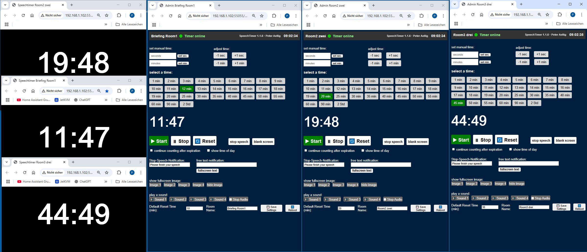

# speechtimer  
I would like to share my latest project: a web based speech timer that makes managing presentations and talks a breeze.

**Introducing SpeechTimer **
I would like to share my latest project: a web based speech timer that makes managing presentations and talks a breeze.

You install Python and the necessary extensions on your computer (PC/Mac/Raspi*), copy the files into the speechtimer directory.   
then you start python app.py and can then access speechtimer and admin in the same network.  
The details are described in the manuals or visible in the code.  
*[Raspi4 Image link](https://drive.google.com/drive/folders/1aS9zuvYhaSjZAqpjX2A-KHDxk3yzTw-w?usp=sharing)

**Tech Stack**  
Flask + Flask SocketIO backend in Python  
– Serves both the public timer page and the secured admin panel  
– Handles real time events (start, stop, reset, adjust time, and custom messages) via WebSockets 

**HTML/CSS/JS Frontend**  
– Admin Panel (admin.html): select preset times, set custom seconds/minutes, start/stop/reset, adjust on the fly, toggle overtime, show/hide clock, send fullscreen text or images, and play/stop sound cues  
– Timer Display (speechtimer.html): full screen countdown with red warning when time’s up, custom “stop speech” messages, blank screen mode, image or text overlays, and optional clock in the corner  

**Key Features**  
-Preset & Custom Timing: one click buttons for common durations plus manual entry  
-Dynamic Control: pause, resume, reset, and even add/subtract seconds or minutes mid timer  
-Notifications: show a custom “Please finish your speech” alert or any free text message in fullscreen  
-Visual Aids: display images or full screen text overlays  
-Audio Cues: built in sound buttons for start/stop or custom effects, all playing through the admin-browser’s audio output  
-Secure Admin Access: basic HTTP auth protects the control panel  
-Speechtimer.html  can run on any (multiple) device in the same network  

Whether you’re running it on a Raspberry Pi or a PC, the browser driven audio/video features work identically—no extra server side audio libraries needed. Perfect for conferences, classrooms, or any live event speaking setup. 

